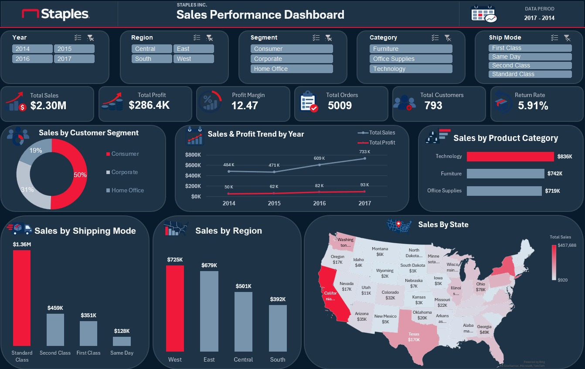

# Retail Sales Analysis & Interactive Excel Dashboard

This is my first end-to-end Excel data analysis project.

I worked with a retail sales dataset and went through the full analysis process — from preparing the data to building an interactive dashboard, then digging deeper into the results to develop business insights and recommendations.

## Tools Used

- Microsoft Excel
- Power Query
- Power Pivot
- PivotTables & PivotCharts
- Excel Data Model

## Project Workflow

Raw Data → Data Cleaning → Data Modeling → Analysis → Dashboard → Insights → Recommendations

## Business Questions

The analysis focused on questions such as:

- What are the total sales and profit?
- What is the overall profit margin?
- How many orders and customers are there?
- Which product categories generate the highest and lowest sales?
- How have sales and profit changed over time?
- How do customer segments, shipping modes, and regions perform?
- What is the return rate?

## Dashboard

The final dashboard provides an interactive view of the main KPIs and business performance using filters for year, region, customer segment, product category, and shipping mode.

## Key KPIs

- Total Sales: **$2.30M**
- Total Profit: **$286.4K**
- Profit Margin: **12.47%**
- Total Orders: **5,009**
- Total Customers: **793**
- Return Rate: **5.91%**

## One of the Key Findings

Furniture generated approximately **$742K in sales**, but only around **$18K in profit**, with a profit margin of approximately **2.49%**.

Further analysis showed that the weakness was concentrated mainly in Tables and Bookcases, particularly among heavily discounted transactions.

## What I Learned

One of the most interesting parts of this project happened when I started working on the recommendations.

I thought I had finished the analysis, but every time I tried to make a recommendation, another question came up and I found myself going back to the data again.

That helped me understand that finishing a dashboard doesn't necessarily mean finishing the analysis.

